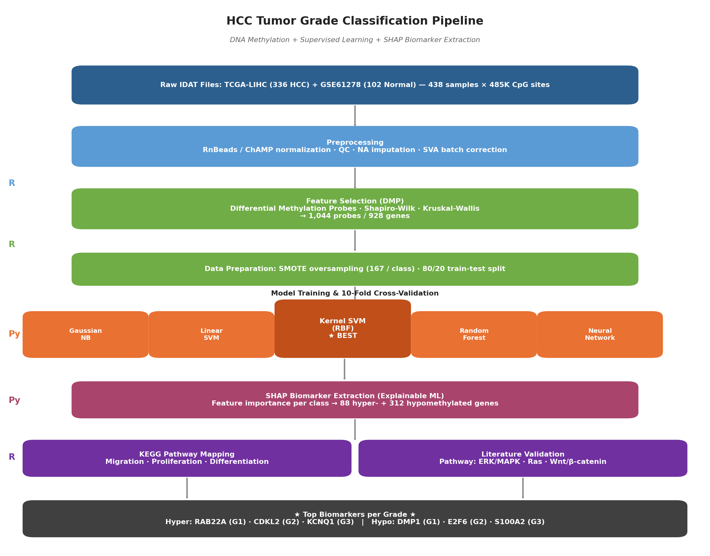

# HCC Grade Classification via DNA Methylation & Machine Learning

   

> **Bachelor's Thesis** — Bandung Institute of Technology (ITB)  
> Biology, School of Life Sciences and Technology 
>
> *Supervised Learning for Tumor Grade Hepatocellular Carcinoma Classification and Biomarker Discovery Based on DNA Methylation Profile of Promoters Region*

**Supervisors:** Husna Nugrahapraja, Ph.D. · Prof. Dr. rer. nat. Marselina Irasonia Tan, M.S.

---

## Pipeline Overview



---

## Background

Hepatocellular Carcinoma (HCC) is the most dominant primary liver cancer (~90%), ranked 6th in worldwide prevalence and 5th in Indonesia (2022), with rising incidence and mortality rates. The Edmondson-Steiner 4-grade system classifies HCC severity based on histological differentiation, and has strong prognostic value. However, HCC exhibits high molecular heterogeneity — making molecular profiling essential for precision cancer medicine.

DNA methylation profiles in HCC correlate with prognosis and tumor progression. Yet methylation data is high-dimensional, complex, and heterogeneous — requiring supervised machine learning for robust classification.

---

## Research Objectives

1. **Classify** HCC tumor grades (G1, G2, G3) and normal tissue based on promoter DNA methylation data using the best supervised learning model
2. **Identify** relevant methylated gene biomarkers (hypermethylated and hypomethylated) per tumor grade using SHAP-based explainable machine learning from the best model
3. **Validate** the biological relevance of identified biomarker genes against cell migration, proliferation, and differentiation processes in HCC tumor grade progression via KEGG pathway analysis

---

## Dataset

| Source | Description | Samples |
|--------|-------------|---------|
| TCGA-LIHC | HCC solid tumor tissue, Illumina HumanMethylation450K | G1: 47, G2: 168, G3: 121 |
| GSE61278 (GEO) | Normal liver tissue (accidental death donors) | NT: 102 |
| **Total** | 438 samples, ~485,000 CpG sites, 99% of RefSeq genes | |

After preprocessing: G1=46, G2=167, G3=120, Normal=100. After SMOTE oversampling: **167 samples per class**.

---

## Results

### Model Performance

| Model | Multi-class | Notes |
|-------|------------|-------|
| Gaussian NB | Low | Eliminated — violated independence assumption |
| Linear SVM | ~90% | Strong; better G3 prediction |
| **Kernel SVM (RBF)** | **~90%** | **Best overall — selected model** |
| Random Forest | <90%, high SD | Eliminated — overfitting (high dim, low N) |
| Neural Network | <90%, high SD | Eliminated — overfitting |

- **Binary G2 vs G3:** Kernel SVM (RBF, γ=0.1) achieves **~85% accuracy**
- G2 and G3 exhibit high methylation similarity, requiring a non-linear RBF kernel for effective separation

### Biomarker Genes Identified via SHAP

Combined 400 relevant genes from Linear SVM + Kernel SVM: **88 hypermethylated**, **312 hypomethylated** relative to normal.

**Top Hypermethylated Biomarkers:**

| Grade | Gene | Biological Role |
|-------|------|----------------|
| G1 | **RAB22A** | RAS protein — promotes tumorigenesis |
| G2 | **CDKL2** | Tumor suppressor — regulates G1/S and G2/M cell cycle transition |
| G3 | **KCNQ1** | Regulates subcellular β-catenin distribution (Wnt pathway) |

**Top Hypomethylated Biomarkers:**

| Grade | Gene | Biological Role |
|-------|------|----------------|
| G1 | **DMP1** | Integrin interaction, tissue mineralization |
| G2 | **E2F6** | Activates AKT pathway in tumorigenesis |
| G3 | **S100A2** | Induces Epithelial-Mesenchymal Transition (EMT) |

> Global hypomethylation in HCC grades G1–G3 is consistent with chromosomal instability, transposable element reactivation, loss of imprinting, and oncogene upregulation. Hypermethylation is associated with tumor suppressor gene silencing.

### KEGG Pathway Validation

**Cell Migration** — 9 hypomethylated + 1 hypermethylated genes mapped:
- Ca²⁺/DAG → Ras signaling activation
- Cell adhesion and cytoskeleton regulation
- Methylation levels consistent with increasing migration ability G1 → G3

**Proliferation & Differentiation** — 10 hypomethylated + 4 hypermethylated genes mapped:
- ERK/MAPK and Ras signaling activation
- Cell cycle, apoptosis, and lipid metabolism regulation
- ROS-mediated carcinogenesis pathway
- Methylation pattern consistent with increasing proliferation and decreasing differentiation G1 → G3

Key enriched pathways: **ERK/MAPK** · **Ras** · **Wnt/β-catenin** · **PI3K/Akt** · **Ca²⁺** · **TNFα-NFκB**

---

## Repository Structure

```
hcc-grade-ml-methylation/
├── README.md
├── LICENSE
├── requirements.txt                        # Python dependencies
├── environment.yml                         # Conda environment (R + Python)
│
├── notebooks/                              # Jupyter notebooks (Python) — numbered by run order
│   ├── 01_model_comparison_main.ipynb      # MAIN: All 5 models trained, evaluated, compared
│   ├── 02a_svm_development.ipynb           # SVM hyperparameter tuning
│   ├── 02b_random_forest_development.ipynb # RF hyperparameter tuning
│   ├── 02c_neural_network_development.ipynb# NN architecture & tuning
│   ├── 03_performance_visualization.ipynb  # Confusion matrices, metric plots
│   ├── 04_shap_biomarker_extraction.ipynb  # SHAP feature importance → biomarker selection
│   ├── 05_biomarker_visualization.ipynb    # Heatmaps, biomarker methylation profiles
│   ├── 06_go_enrichment_plot.ipynb         # GO enrichment visualization
│   └── 07_clustering_visualization.ipynb   # PCA & clustering plots
│
├── scripts/
│   ├── preprocessing/                      # R — QC, normalization, DMP analysis
│   │   ├── preprocessing_hcc.Rmd           # Main preprocessing pipeline (ChAMP)
│   │   ├── preprocessing_hcc_RnBeads.Rmd   # Alternative: RnBeads normalization
│   │   ├── findingDMP.Rmd                  # Differential Methylation Probe finding
│   │   ├── DMR.Rmd                         # Differential Methylation Region (auxiliary)
│   │   ├── impute_sva_dmp.Rmd              # NA imputation + SVA batch correction
│   │   └── ...                             # Additional QC/handling scripts
│   ├── feature_selection/                  # R — DMP significance testing
│   │   ├── 1_data_prep.R                   # Data preparation for tests
│   │   ├── shapiro_paired.R                # Shapiro-Wilk normality test
│   │   └── kruskal-wallis.R                # Kruskal-Wallis test → 1,044 probes
│   ├── exploration/                        # R — PPI exploration (NOT in main pipeline)
│   │   ├── PPI_meth.R, PPI_Meth_2.R        # STRING-DB protein-protein interactions
│   │   ├── stringdb_train.R                # Network training/exploration
│   │   ├── sparse_beta_label.R             # Beta value sparsity exploration
│   │   └── label.txt
│   ├── enrichment/                         # R — GSEA, ClusterProfiler, volcano plots
│   │   ├── gsea.Rmd                        # Gene Set Enrichment Analysis
│   │   ├── clusterprofiler.R               # GO/KEGG enrichment
│   │   ├── volcanoplot.R                   # Volcano plots per grade
│   │   └── *.gmt                           # Custom gene sets (migration/prolif/diff)
│   └── pathway/                            # R — KEGG pathway mapping (sequential)
│       ├── 01_combine_shap_features.R      # Combines SHAP outputs
│       ├── 02_build_rank_set.R             # Builds rank set per grade
│       ├── 03_normalize_rank.R             # Normalizes for pathview
│       ├── 04_pathway_enrichment.R         # Pathway enrichment (enrichKEGG)
│       ├── 05_kegg_view_mapping.R          # KEGG view mapping
│       └── 06_pathview_visualization.R     # Final pathview rendering
│
├── data/
│   ├── raw/                                # (not tracked — download from GDC/GEO)
│   └── processed/
│       ├── beta_bionfo.csv                 # Beta value matrix (1,044 probes × samples)
│       ├── samplesheet_HCCNormal451.csv    # Sample metadata (438 samples)
│       ├── Tumor_grade_HCC349.csv          # Tumor grade labels
│       ├── gene_list.txt                   # Selected 928 genes
│       ├── features_importances_*.txt      # SHAP feature importances per model
│       └── CM.xlsx / PRO.xlsx / DF.xlsx    # Cell Migration / Proliferation / Differentiation
│
└── results/
    ├── figures/
    │   ├── pipeline_diagram.png            # Main pipeline overview
    │   └── ...                             # EDA: CpG distribution, PCA, probe plots
    ├── gsea/                               # GSEA enrichment & volcano plots (G1/G2/G3)
    └── kegg/                               # KEGG pathway maps (hsa04110, hsa05206, hsa05224)
```

---

## Getting Started

### Option 1: Conda environment (recommended)
```bash
conda env create -f environment.yml
conda activate hcc-grade-ml
```

### Option 2: Manual install
```bash
# Python
pip install -r requirements.txt

# R packages
Rscript -e 'BiocManager::install(c("ChAMP","RnBeads","limma","sva","minfi","clusterProfiler","pathview","org.Hs.eg.db"))'
Rscript -e 'install.packages(c("ggplot2","dplyr","reshape2","pheatmap"))'
```

### Run Order

1. **Preprocessing** → `scripts/preprocessing/preprocessing_hcc.Rmd`
2. **DMP Feature Selection** → `scripts/preprocessing/findingDMP.Rmd` → `scripts/feature_selection/kruskal-wallis.R`
3. **ML Classification** → `notebooks/01_model_comparison_main.ipynb`
4. **SHAP Biomarker Extraction** → `notebooks/04_shap_biomarker_extraction.ipynb`
5. **Biomarker Visualization** → `notebooks/05_biomarker_visualization.ipynb`
6. **GSEA Enrichment** → `scripts/enrichment/gsea.Rmd` → `scripts/enrichment/clusterprofiler.R`
7. **KEGG Pathway Mapping** → `scripts/pathway/01_*.R` through `06_*.R`
8. **PPI Exploration** *(optional, not in main pipeline)* → `scripts/exploration/PPI_meth.R`

---

## Data Sources

| Dataset | Link | Description |
|---------|------|-------------|
| TCGA-LIHC | [GDC Portal](https://portal.gdc.cancer.gov/) | HCC tumor samples, Illumina 450K |
| GSE61278 | [NCBI GEO](https://www.ncbi.nlm.nih.gov/geo/query/acc.cgi?acc=GSE61278) | Normal liver tissue |

> Raw IDAT files are not included due to size. Download using GDC Data Transfer Tool with the manifest in `data/raw/`.

---

## Citation

```
Hakim, D. (2024). Supervised Learning dalam Klasifikasi Tumor Grade Hepatocellular
Carcinoma Berdasarkan Metilasi DNA Daerah Promoter. Bachelor's Thesis,
Program Studi S1 Biologi, Institut Teknologi Bandung (ITB).
```

---

## License

This project is licensed under the MIT License — see [LICENSE](LICENSE) for details.
